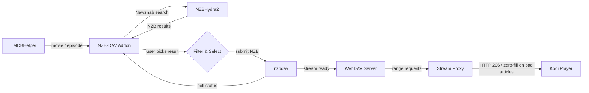
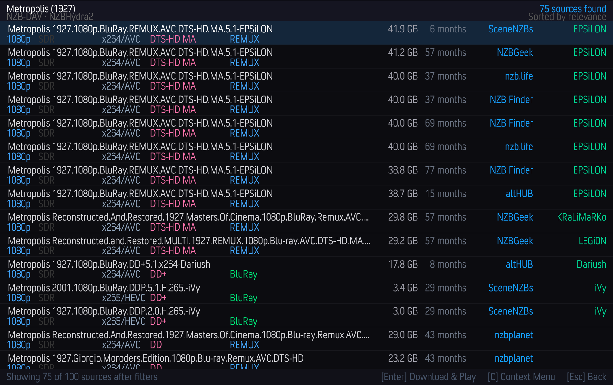

# NZB-DAV Kodi Addon

[](https://github.com/xbmc4lyfe/nzbdavkodi/actions/workflows/ci.yml)
[](https://github.com/xbmc4lyfe/nzbdavkodi/actions/workflows/pylint.yml)
[](https://github.com/xbmc4lyfe/nzbdavkodi/actions/workflows/codeql.yml)
[](https://github.com/xbmc4lyfe/nzbdavkodi/actions/workflows/release.yml)
[](https://coderabbit.ai)
[](https://www.gnu.org/licenses/gpl-3.0)
[](https://kodi.tv/)
[](https://www.python.org/)

A Kodi 21 (Omega) player/resolver addon that enables Usenet-based streaming through NZBHydra2 (or Prowlarr) and nzbdav. Works as a TMDBHelper player -- search for a movie or TV episode, pick an NZB, and stream it directly through nzbdav's WebDAV server.

> **Current release: `v1.2.3`** on `main`. Highlights on this branch:
>
> - **Proxy fallback hardening**: MKV playback can now carry standby fallback sources through the local proxy, survive repeated upstream outages, and use prepare-time settings snapshots instead of unsafe service-thread Kodi setting reads.
> - **Kodi repository install fix**: repository metadata now publishes a strict 32-byte `addons.xml.md5`, matching Kodi's checksum reader and fixing "Could not connect to repository" after installing the repo zip from GitHub Pages.
> - **RunScript setting/path reliability**: script playback reads translated profile settings paths and writes stage logs through Kodi's temp path before falling back to the CoreELEC temp path.
> - **WebDAV URL encoding**: stream URLs now encode spaces and plus signs from PROPFIND paths before playback.
> - **Kodi add-on info hotfix**: the Kodi-visible release notes are kept to a short current-release summary so opening the add-on info dialog does not load the oversized historical changelog that froze CoreELEC/Kodi builds.
> - **Broader fallback discovery**: unsupported or obfuscated candidate NZBs can use the indexer's reported size as conservative fallback evidence, while a +/-25% indexer-size prefetch gate skips obvious mismatches before downloading large NZBs.
> - **Faster repeated manifest checks**: raw NZB downloads are cached with a small LRU, but each caller still reparses the bytes so health checks can select different valid files.
> - **Cleaner nzbdav failure handling**: terminal failed history rows now beat stale active queue progress, avoiding the stuck-at-an-old-percentage dialog after article-not-found failures.
> - **RunScript fallback discovery**: TMDBHelper script-mode picks now submit duplicate-release standby streams the same way the plugin-handle picker path does, with a thread-safe settings getter plumbed through every fallback path so the work runs cleanly off the main thread.
> - **TMDBHelper RunScript playback handoff**: TMDBHelper enters the addon through a script-mode player path that avoids the plugin-handle resolver freeze while still routing playback through the local proxy.
> - **Pass-through-first proxy**: MKV and other non-MP4 streams use byte pass-through by default, preserving native source seeking and zero-fill recovery. Force-remux is now optional, with threshold `0` meaning fully off.
> - **Live fallback streams**: duplicate NZB releases are enabled by default with up to 5 standby submissions, grouped by NZB manifest payload metadata, and validated with exact content length plus 1000 sampled byte ranges before switching.
> - **MP4 rewrite remains first-class**: moov-at-tail MP4s are rewritten in pure Python for native Kodi seek; already-faststart MP4s use the local pass-through proxy so fallback/rescue session handling stays available by default.
> - **Prowlarr support** as an alternative indexer to NZBHydra2.
> - **Dolby Vision routing matrix**: P5 / P7 FEL / P8 / unknown DV are routed to matroska automatically; P7 MEL and non-DV go to fmp4 HLS when that mode is selected.
> - **Hardening**: probe-thread starvation survival on submit, NZBHydra2 search cap raised to 10000, co64 chunk-offset support for MP4s ≥ 4 GB, MKV SimpleBlock-lacing rejection, ffmpeg `-headers` CR/LF stripping, cross-origin PROPFIND href trust path.
>
> See [CHANGELOG.md](CHANGELOG.md) for the full per-release record.

## How It Works



No separate SABnzbd needed -- nzbdav handles both downloading and serving.

## Stream Proxy

Every playback request is routed through a local HTTP proxy (`stream_proxy.py`) running on a random port in the background service. Kodi never talks to the WebDAV server directly, which sidesteps a PROPFIND parent-directory scan that caused `Open - Unhandled exception` errors on several Kodi builds.

The proxy picks one of four paths based on the container, fallback metadata, file size, and the configured `force_remux_mode`:

1. **MP4 (already faststart)** -- served through the local pass-through proxy, preserving native range seeking while keeping proxy session tracking available for fallback/rescue handling.
2. **MP4 (moov at tail)** -- parsed in pure Python via HTTP range requests, `stco` and `co64` chunk offsets rewritten (so 4 GB+ MP4s work on 32-bit Kodi), and served as a virtual faststart MP4 with `Accept-Ranges: bytes`. If parsing fails, falls back to an ffmpeg tempfile remux.
3. **MKV and other containers (default path)** -- served as a byte pass-through with ranged upstream fetches. Kodi gets native seeking from the source file's real Cues, and the proxy layers zero-fill recovery on top: when an upstream read fails mid-stream, it probes forward to the next readable offset, writes zero bytes across the gap, and keeps streaming.
4. **Optional force-remux tier** -- when `force_remux_mode` is set to matroska or fMP4 HLS and the stream is above the non-zero threshold, the proxy uses ffmpeg:
   - **Piped Matroska (DV-safe)** -- `ffmpeg -c copy -f matroska pipe:1`, unsized. Known-good on Dolby Vision HEVC + TrueHD/Atmos 100 GB REMUXes. Seek is approximate (each seek respawns ffmpeg with `-ss`).
   - **Fragmented MP4 HLS (experimental, opt-in)** -- produces an HLS VOD playlist with per-segment `hvc1`-tagged fMP4 + a canonical `init.mp4` that survives seek respawns. Gives full random seek across multi-hundred-gigabyte sources. **Self-healing**: if ffmpeg fails to start or doesn't produce a valid init segment within 30 s, the proxy automatically rewrites the session to the matroska branch *before* Kodi sees a broken URL.

**Dolby Vision routing matrix** (applied within the force-remux tier): P5, P7 FEL, P8, and unknown-DV sources are routed to **matroska** (the safest option on Amlogic CAMLCodec). P7 MEL and confirmed non-DV are eligible for **fmp4 HLS** when that mode is selected. P7 FEL specifically is forced to matroska because fmp4 cannot carry dual-layer HEVC.

If ffmpeg isn't installed, the proxy degrades gracefully to pass-through.

> **Architecture deep-dive:** [`TODO.md` Part C](TODO.md#part-c--stream-proxy-architecture-reference-proxymd) documents the full session lifecycle, how the proxy interacts with `resolver.py` / `service.py` / `router.py` / `mp4_parser.py`, the HLS producer internals, and where to look when debugging playback failures. (The former standalone `PROXY.md` was consolidated into `TODO.md` on 2026-04-24.)

### Live Fallback Streams

When **Submit duplicate releases as live fallbacks** is enabled, the resolver attaches conservative duplicate candidates from the result list and submits them after the primary NZB is accepted. This is enabled by default. Standby submits run in a background worker so primary playback can continue polling immediately. Once playback starts, the proxy keeps the fallback job metadata with the session and can switch to another prepared stream if the active source becomes unrecoverable.

Fallback grouping is based on the NZB manifest's selected payload entry, not the search result size. The addon fetches each candidate NZB, prefers the main video filename and file-level segment-byte total when visible, and falls back to a provisional archive/RAR grouping key when only archive parts are visible. If the parser cannot extract a usable video entry from an otherwise plausible candidate, the addon can synthesize conservative video evidence from the indexer's reported size when it is at least 100 MB. Candidates with the same selected payload Article Message-IDs, or the same link-derived synthetic digest, are treated as mirrored copies of the same NZB and are not used as fallbacks.

Before fetching a candidate NZB for selection-time fallback evidence, the addon also rejects candidates whose indexer-reported sizes are more than +/-25% away from the selected result. This is intentionally wider than the manifest match gate because indexer sizes can include RAR/PAR2 overhead, but it avoids downloading large NZBs for obvious size mismatches.

Runtime switching still requires exact WebDAV `Content-Length` equality and 1000 pseudo-random 4096-byte fingerprint samples before the proxy switches to a fallback source. **Maximum fallback releases** caps how many standby submits are attached per primary result and defaults to `5`.

Fallback recovery is the only rescue path for fallback sessions: if no validated fallback source can resume the failed range, the proxy closes the stream instead of retrying the original source, zero-filling, or probing forward to skip bytes.

Force-remux remains available for environments that need ffmpeg compatibility paths, but pass-through is the default. Setting **Force ffmpeg remux above (MB, 0=off)** to `0` disables non-MP4 force-remux entirely, including unknown-length streams.

## Requirements

| Component | Description |
|-----------|-------------|
| **Kodi 21 (Omega)** | Or later |
| **NZBHydra2** *or* **Prowlarr** | At least one indexer aggregator running and accessible |
| **nzbdav** | Running and accessible (provides SABnzbd-compatible API + WebDAV) |
| **TMDBHelper** | To trigger searches |
| **ffmpeg** *(recommended)* | Required for force-remux. Without it the proxy falls back to pass-through for all files. |

## Installation

### Via Kodi Repository (recommended)

Install through the NZB-DAV repository for automatic updates:

1. In Kodi: **Settings > File Manager > Add source** > enter `https://xbmc4lyfe.github.io/nzbdavkodi/` > name it `nzbdav`
2. **Settings > Add-ons > Install from zip file** > `nzbdav` > `repository.nzbdav` > `repository.nzbdav-1.1.0.zip`
3. **Settings > Add-ons > Install from repository > NZB-DAV Repository > Video add-ons > NZB-DAV**
4. Future updates are installed automatically

### Manual Install

1. Download the addon zip from the [releases page](../../releases)
2. In Kodi: **Settings > Add-ons > Install from zip file** > select `plugin.video.nzbdav.zip`

---

## TMDBHelper Setup

NZB-DAV works as a player for TMDBHelper, which provides the movie/TV browsing interface. If you don't have TMDBHelper installed yet:

### 1. Install TMDBHelper

TMDBHelper is available from the official Kodi repository:

1. **Settings > Add-ons > Install from repository > Kodi Add-on repository > Video add-ons > TheMovieDb Helper**
2. Click **Install** and wait for the notification

If it's not in the official repo for your Kodi version, install from the [TMDBHelper GitHub releases](https://github.com/jurialmunkey/plugin.video.themoviedb.helper/releases):

1. Download the latest `plugin.video.themoviedb.helper` zip
2. **Settings > Add-ons > Install from zip file** > select the downloaded zip

### 2. Configure TMDBHelper

1. Open TMDBHelper settings: **Add-ons > My add-ons > Video add-ons > TheMovieDb Helper > Configure**
2. Under **API Keys**, enter a [TMDB API key](https://www.themoviedb.org/settings/api) (free account required)
3. Under **Players**, set **Default player** to **NZB-DAV** for both Movies and TV Shows

### 3. Install the NZB-DAV Player File

The player file tells TMDBHelper how to call NZB-DAV:

1. Open NZB-DAV settings: **Add-ons > My add-ons > Video add-ons > NZB-DAV > Configure**
2. Click **Install Player File** (installs directly to TMDBHelper)
3. Restart Kodi (or go to TMDBHelper settings > **Players** > **Update players**)

### 4. Set NZB-DAV as the Default Player

1. Open TMDBHelper settings > **Players**
2. Set **Default player (Movies)** to **NZB-DAV**
3. Set **Default player (TV Shows)** to **NZB-DAV**

With this configured, selecting any movie or episode in TMDBHelper will automatically search and stream via NZB-DAV without a player selection prompt.

> **Tip:** If you want to keep multiple players available (e.g., NZB-DAV + a Debrid service), leave the default player as **Choose** and you'll get a player selection dialog each time.

---

## Configuration

Open the addon settings (**Add-ons > My add-ons > Video add-ons > NZB-DAV > Configure**):


### Connection Settings

| Setting | Where to find it |
|---------|-----------------|
| NZBHydra2 URL | URL to your NZBHydra2 instance (e.g., `http://192.168.1.100:5076`) |
| NZBHydra2 API Key | NZBHydra2 web UI > `http://<hydra>:5076/config/main` > **Security** section > **API key** |
| nzbdav URL | URL to your nzbdav instance (e.g., `http://192.168.1.100:3333`) |
| nzbdav API Key | nzbdav web UI > `http://<nzbdav>/settings` > **Usenet** tab > **API Key** |
| WebDAV Username | nzbdav web UI > `http://<nzbdav>/settings` > **WebDAV** tab > **Username** |
| WebDAV Password | nzbdav web UI > `http://<nzbdav>/settings` > **WebDAV** tab > **Password** |

#### Prowlarr (optional, alternative to NZBHydra2)

Enable **Prowlarr** in addon settings to use Prowlarr as the search backend instead of (or alongside) NZBHydra2:

| Setting | Description |
|---------|-------------|
| Enable Prowlarr | Turn on Prowlarr search |
| Prowlarr URL | URL to your Prowlarr instance (e.g., `http://localhost:9696`) |
| Prowlarr API Key | Prowlarr web UI > **Settings > General > Security** > API Key |
| Prowlarr Indexer IDs | Comma-separated indexer IDs to query (leave blank for all) |
| Test Prowlarr Connection | Action button — verifies URL + API key + indexer reachability |

> **Tip for entering long API keys:** Use a Kodi remote app with keyboard support (e.g., Sybu on iPhone). Navigate to the nzbdav/NZBHydra2/Prowlarr settings page on your computer, copy the key, then paste from your clipboard into the Kodi input field via the remote app's on-screen keyboard.

### Player Installation

Click **Install Player File** to install the `nzbdav.json` player to TMDBHelper. This registers NZB-DAV as a playback source in TMDBHelper's player selection menu. The player is installed directly to TMDBHelper's players directory.

### Quality Filters

All filters default to **everything enabled** -- deselect what you don't want.

| Filter | Options |
|--------|---------|
| Resolution | 2160p, 1080p, 720p, 480p |
| HDR | HDR10, HDR10+, Dolby Vision, HLG, SDR |
| Audio | Atmos, TrueHD, DTS-HD MA, DTS:X, DD+, DD, AAC |
| Video Codec | x265/HEVC, x264/AVC, AV1, VP9, MPEG-2 |
| Language | EN, ES, FR, DE, IT, PT, NL, RU, JA, KO, ZH, AR, HI |

### Keyword Filters

| Setting | Description |
|---------|-------------|
| Preferred release groups | Comma-separated (e.g., `SPARKS,FGT,NTb`) -- boosted to top |
| Excluded release groups | Comma-separated -- removed from results |
| Min file size | In MB (0 = no limit) |
| Max file size | In MB (0 = no limit) |
| Exclude keywords | Comma-separated |
| Require keywords | Comma-separated |

### Sort & Display

| Setting | Options | Default |
|---------|---------|---------|
| Sort by | Relevance, Size (largest/smallest), Age (newest/oldest) | Relevance |
| Max results | 1--100 | 25 |

### Relevance Sort Order

When sorted by relevance, results are ranked by priority:

| Priority | Criteria | Ranking |
|----------|----------|---------|
| 1 | Resolution | 4K > 1080p > 720p > 480p |
| 2 | HDR | Dolby Vision > HDR10+ > HDR10 > HLG > SDR |
| 3 | Preferred group | Configured groups boosted |
| 4 | Audio | TrueHD+Atmos > Atmos DD+ > TrueHD > DTS:X > DTS-HD MA > DTS > DD+ > DD > AAC |
| 5 | Size | Largest first |

### Polling

| Setting | Description | Default |
|---------|-------------|---------|
| Poll interval | Seconds between status checks | 5 |
| Download timeout | Max wait time in seconds | 3600 |
| Submit timeout | Max wait for nzbdav submit-NZB API to respond (seconds) | 120 |

### Search Cache

| Setting | Description | Default |
|---------|-------------|---------|
| Cache duration | Seconds to cache search results (0 to disable) | 300 |
| Clear Cache | Available from addon main menu | -- |

### Auto-Select

| Setting | Description | Default |
|---------|-------------|---------|
| Auto-select best match | Automatically pick the top result and skip the selection dialog | Off |

### Advanced

These tune stream-proxy behaviour. Defaults are safe; only flip these if you have a reason.

| Setting | Description | Default |
|---------|-------------|---------|
| Submit duplicate releases as live fallbacks | Submit conservative duplicate releases in the background and keep them as standby streams for live proxy switching | On |
| Maximum fallback releases | Maximum standby releases attached per primary result | 5 |
| Force remux output format | `Direct pass-through (default)` / `Fragmented MP4 HLS (compatibility, experimental)` / `Piped Matroska (seek limited, DV-safe)` | Direct pass-through |
| Force ffmpeg remux above (MB, 0=off) | File size above which the proxy switches to the optional force-remux tier; `0` disables non-MP4 force-remux entirely, including unknown-length streams | 15000 (~15 GB) |
| Convert MP4 subtitles to SRT | mov_text → SRT during remux so embedded subs survive the matroska/HLS pipeline | On |
| Strict contract mode | How to react when nzbdav responds with HTTP shapes that violate the strict Range/Content-Length contract: `Off` / `Warn only` / `Enforce` | Warn only |
| Density breaker | Abort streams where recovery zero-fill exceeds 50% of a sliding window (catches dead releases early) | Off |
| Zero-fill budget | Cap total per-stream zero-fill bytes; stream terminates with a clean error when the budget is hit | On |
| Retry ladder | Re-issue the original Range request with backoff on transient upstream errors before falling back to skip-fill | On |
| Send 200 for no-range pass-through | Send `200 OK` instead of always `206 Partial Content` when Kodi requests a full object. **Off by default** until validated on the target build. | Off |

1. Open **TMDBHelper** and browse to a movie or TV episode
2. Select **Play with NZB-DAV**
3. Pick an NZB from the full-screen results dialog
4. Wait for the download to complete (progress dialog shows status)
5. Playback starts automatically from nzbdav's WebDAV server

### Results Dialog

The results dialog shows all matching NZBs with color-coded quality labels, sorted by relevance. Each row displays the release name, resolution, codec, audio format, release type, file size, age, indexer, and release group.



The status bar at the bottom shows how many sources passed your filters. Use **Enter** to download and play, **C** for the context menu, or **Esc** to go back.

With **Auto-select best match** enabled, the dialog is skipped and the top result plays automatically.

---

## Development

For a contributor-facing map of the search, resolve, and stream proxy paths, see
the [architecture overview](docs/architecture.md).

### Prerequisites

- Python 3.10+ for local test tooling
- Kodi addon runtime remains Python 3.8+
- [just](https://github.com/casey/just) (command runner)

### Commands

```bash
just test              # Run all 695 unit tests (integration tests excluded)
just test-verbose      # Run unit tests with full output
just test-integration  # Run integration tests against a real ffmpeg binary
just lint              # Check ruff + black formatting
just lint-fix          # Auto-fix lint issues
just release           # Build plugin.video.nzbdav.zip
just ship              # Run tests then build release
just repo              # Build release + generate Kodi repo in repo/zips/
just repo-zip          # Build repo + copy repository zip to cwd
just clean             # Remove build artifacts
just dist-clean        # Remove build artifacts + repo/zips/
```

### Project Structure

```
repo/plugin.video.nzbdav/
  addon.xml              # Kodi addon manifest
  addon.py               # Entry point
  service.py             # Background service (stream proxy + playback monitor)
  resources/
    settings.xml         # Kodi settings UI
    lib/
      router.py            # URL routing
      hydra.py             # NZBHydra2 API client
      prowlarr.py          # Prowlarr API client (alternative indexer)
      nzbdav_api.py        # nzbdav API client
      webdav.py            # WebDAV availability checker
      filter.py            # Result filtering with PTT
      results_dialog.py    # Custom full-screen results dialog
      resolver.py          # Download + polling orchestrator
      stream_proxy.py      # Local HTTP proxy -- pass-through, MP4 rewrite, optional remux
      mp4_parser.py        # Pure-Python MP4 moov / stco / co64 rewriter
      dv_source.py         # Dolby Vision source probe (profile / RPU detection)
      dv_rpu.py            # DV RPU NAL parser
      cache.py             # JSON-based search result cache
      fallback_streams.py  # Duplicate release fallback selection and payloads
      cache_prompt.py      # Legacy cache compatibility prompt helpers
      kodi_advancedsettings.py  # Probe Kodi's advancedsettings.xml cache settings
      player_installer.py  # TMDBHelper player JSON installer
      http_util.py         # Shared HTTP utilities
      i18n.py              # Localization helper
      ptt/                 # Vendored PTT library (parse-torrent-title)
    language/             # Kodi localization files
    skins/Default/
      1080i/results-dialog.xml  # Dialog skin XML
      media/white.png           # Texture for backgrounds
scripts/
  build_zip.py           # Addon zip builder
  generate_repo.py       # Kodi repo metadata generator
repo/
  repository.nzbdav/     # Repository addon (points to raw GitHub)
  zips/                  # Generated Kodi repository metadata and zips
.github/workflows/
  ci.yml                 # Test + lint on push/PR (Python 3.10/3.12)
  release.yml            # Build + deploy on version tags
  pylint.yml             # Pylint analysis (Python 3.8 to validate runtime compat)
  codeql.yml             # CodeQL analysis
  bandit.yml             # Bandit security scan
tests/
  conftest.py                       # Kodi module mocks
  test_*.py                         # 695 unit tests
  test_integration_hls_ffmpeg.py    # 2 integration tests (real ffmpeg, opt-in)
TODO.md                             # Consolidated roadmap + architecture (Parts A–E)
```

### Releasing

1. Bump `version` in `repo/plugin.video.nzbdav/addon.xml`
2. Run `just repo` to refresh `repo/zips/` for raw GitHub repository metadata.
3. Stage the version bump plus generated repository metadata and zips:
   `git add repo/plugin.video.nzbdav/addon.xml repo/zips/`
4. Commit: `git commit -am "release: v0.X.0"`
5. Tag and push: `git tag v0.X.0 && git push origin main v0.X.0`
6. GitHub Actions builds the zip and creates a GitHub Release
7. Kodi picks up the update automatically from the repository metadata in `repo/zips/`

---

## Compatibility

| Platform | Supported |
|----------|-----------|
| Kodi | 21 (Omega) and later |
| Python | 3.8+ |
| OS | CoreELEC, LibreELEC, OSMC, Windows, macOS, Linux |
| Architecture | ARM64 (aarch64), x86_64 |
| Dependencies | None -- all vendored, no pip required |

---

## Extras

### warmup-rs -- Rust-based TMDBHelper cache warmer (recommended)

A static Rust binary that warms TMDBHelper's `ItemDetails.db` cache and Kodi's image texture cache by writing directly to SQLite -- no JSON-RPC, no plugin invocation. Lives in [`tmdbhelper-warmup-rs/`](tmdbhelper-warmup-rs/) and is **independent of the addon**.

**Two modes:**

| Mode | What it does | Throughput |
|------|-------------|------------|
| `--mode=metadata` (default) | Fetches movies, TV, persons, and collections from the TMDB API with `append_to_response` and writes all 30+ tables in `ItemDetails.db`. Crawls 5 hops deep: seeds + similar + cast filmographies + crew + collections. | ~40 items/s |
| `--mode=images` | Reads every art path from `ItemDetails.db`, downloads from the TMDB CDN at the correct resolution (original for backdrops, w1280 for everything else), saves to `Thumbnails/`, and registers all URL variants in `Textures13.db` so Kodi never needs to fetch images on-demand. | ~45 images/s |

Both modes share the same `state.db` priority queue (depth ASC, popularity DESC) and are restart-safe -- the metadata service picks up where it left off, and the image service skips already-downloaded files on disk.

**Key design choices:**

- Bypasses TMDBHelper entirely -- writes directly to its `ItemDetails.db` schema (30+ normalized tables). This is 290x faster than the Python JSON-RPC approach (~0.14/s) because there's no Kodi plugin serialization bottleneck.
- Mega-transactions: 200 items per SQLite commit for B-tree page locality on USB storage.
- WAL mode with `synchronous=OFF` for safe concurrent reads (Kodi) + writes (warmup-rs).
- Image mode uses Kodi's CRC-32/MPEG-2 hash (ported from `xbmc/utils/Crc32.cpp`) to compute cached filenames. Registers multiple URL variants per image (original, w1280, w780, etc.) pointing to one cached file, so Kodi finds a cache hit regardless of its `imageres` setting.

**Requirements:**

- CoreELEC (or any aarch64 Linux). The binary is a static musl build with no runtime dependencies.
- A USB SSD (recommended) or fast storage mounted at `/var/media/CACHE_DRIVE`. Internal eMMC works but is slower and has limited space for images.
- TMDBHelper 6.x installed (it created the `ItemDetails.db` schema). The warmer creates tables if needed for `Textures13.db`.

**Build and deploy:**

```bash
# Cross-compile from macOS/Linux (requires Docker for cross).
cd tmdbhelper-warmup-rs
cross build --release --target aarch64-unknown-linux-musl

# Deploy the ~5.5 MB static binary.
scp target/aarch64-unknown-linux-musl/release/warmup-rs \
    root@coreelec.local:/storage/tmdb/warmup-rs

# Smoke test on the box.
ssh root@coreelec.local '/storage/tmdb/warmup-rs --mode=smoke'
# Expected: "smoke ok: rusqlite=3.x.y"
```

**Systemd units:**

Two separate services so they can be started/stopped independently:

```bash
# Deploy both service files.
scp tmdbhelper-warmup-rs.service tmdbhelper-warmup-images.service \
    root@coreelec.local:/storage/.config/system.d/

# Enable + start both.
ssh root@coreelec.local '
  systemctl daemon-reload
  systemctl enable tmdbhelper-warmup-rs tmdbhelper-warmup-images
  systemctl start tmdbhelper-warmup-rs tmdbhelper-warmup-images
'
```

**Operate:**

```bash
# Monitor both services.
ssh root@coreelec.local 'journalctl -u tmdbhelper-warmup-rs -f'
ssh root@coreelec.local 'journalctl -u tmdbhelper-warmup-images -f'

# Check progress.
ssh root@coreelec.local '
  sqlite3 /var/media/CACHE_DRIVE/tmdb/scriptcache/state.db \
    "SELECT (SELECT COUNT(*) FROM visited), (SELECT COUNT(*) FROM queue);"
  sqlite3 /var/media/CACHE_DRIVE/tmdb/Textures13.db "SELECT COUNT(*) FROM texture;"
  du -sh /var/media/CACHE_DRIVE/tmdb/Thumbnails/
'

# Lower concurrency during video playback.
ssh root@coreelec.local '
  systemctl stop tmdbhelper-warmup-rs tmdbhelper-warmup-images
  # Edit concurrency in the .service files, then:
  systemctl daemon-reload
  systemctl start tmdbhelper-warmup-rs tmdbhelper-warmup-images
'

# Stop gracefully.
ssh root@coreelec.local 'systemctl stop tmdbhelper-warmup-rs tmdbhelper-warmup-images'
```

**CLI flags:**

| Flag | Default | Description |
|------|---------|-------------|
| `--mode` | `metadata` | `metadata`, `images`, or `smoke` |
| `--concurrency` | `40` | Number of concurrent TMDB API / CDN fetchers |
| `--batch-size` | `200` | Items per SQLite mega-transaction (metadata mode) |
| `--state-db` | `/var/media/CACHE_DRIVE/tmdb/scriptcache/state.db` | Priority queue + visited tracking |
| `--item-details-db` | (see note) | Path to TMDBHelper's ItemDetails.db |
| `--textures-db` | `/var/media/CACHE_DRIVE/tmdb/Textures13.db` | Kodi's texture cache DB (images mode) |
| `--thumbnails-dir` | `/var/media/CACHE_DRIVE/tmdb/Thumbnails` | Kodi's thumbnail directory (images mode) |
| `--tmdb-api-key` | TMDBHelper's bundled key | TMDB API v3 key |

> **Note:** The `--item-details-db` default in the binary points to Kodi's standard addon_data path, but on CoreELEC with a CACHE_DRIVE the DB is symlinked elsewhere. The systemd unit overrides this to `/var/media/CACHE_DRIVE/tmdb/database_07/ItemDetails.db`.

**Notes:**

- Both services run at `Nice=19` and `IOSchedulingPriority=7` (lowest) so Kodi always gets priority for CPU and disk I/O.
- Running both services simultaneously at high concurrency saturates USB SSD write bandwidth. The sweet spot on a 4-core ARM box with USB 3.0 SSD is ~40 metadata workers + ~25 image workers (~85 items/s combined).
- The image service registers multiple Textures13.db entries per image (e.g., original + w1280 + w780 for backdrops) so Kodi finds a cache hit regardless of its `imageres`/`fanartres` settings.
- Image disk budget is ~250-350 GB for a full 1.3M-image crawl. Monitor `df` on CACHE_DRIVE.
- The queue at depth 5 grows to ~1.3M items. Full metadata crawl takes ~9 hours at 40/s; full image crawl takes ~8 hours at 45/s. Both run in parallel.

---

### TMDBHelper cache warmup -- Python (legacy)

The original Python warmup service. Slower (~0.14 items/s) because it drives TMDBHelper through Kodi's JSON-RPC, but guaranteed schema-compatible with any TMDBHelper version. Use this if you don't want to cross-compile Rust or if you need Trakt-seeded personal lists.

Lives in [`tmdbhelper-warmup/`](tmdbhelper-warmup/) and is **independent of the addon**.

**What it does:**

- Drives TMDBHelper via Kodi's JSON-RPC `Files.GetDirectory` against `plugin://plugin.video.themoviedb.helper/` URLs. This invokes TMDBHelper's normal fetch + cache code path, so the cache it produces is in whatever format your installed TMDBHelper version expects.
- Seeds from three sources: Trakt user lists (watchlist / collection / history), Trakt's public popular/trending endpoints, and TMDB's daily ID export files (~50K movies + 20K TV + 30K people, ranked by popularity).
- Crawls each seed and 2 hops out (similar items, cast filmographies, crew, collections), with a SQLite priority queue ordered by popularity.
- Logs to journald with proper severity levels. One milestone line per 100 items or per 5 minutes.

**Requirements:**

- CoreELEC (or any systemd-based distro) on the same box as Kodi.
- Python 3.10+ (CoreELEC ships 3.13).
- `sqlite3` CLI on the box.
- TMDBHelper 6.x installed and configured (Trakt login optional but adds personal seeds).
- ~1 GB free writable storage.

**Install:**

```bash
# 1. Copy the script files to the box.
ssh root@coreelec.local 'mkdir -p /var/media/CACHE_DRIVE/tmdb/scriptcache/runs'
scp tmdbhelper-warmup/*.py root@coreelec.local:/var/media/CACHE_DRIVE/tmdb/scriptcache/

# 2. Drop the systemd unit.
scp tmdbhelper-warmup/tmdbhelper-warmup.service \
    root@coreelec.local:/storage/.config/system.d/

# 3. Sanity-check.
ssh root@coreelec.local 'python3 /var/media/CACHE_DRIVE/tmdb/scriptcache/warmup.py --ping'

# 4. Enable + start.
ssh root@coreelec.local '
  systemctl daemon-reload
  systemctl enable tmdbhelper-warmup
  systemctl start tmdbhelper-warmup
'
```

**Operate:**

```bash
ssh root@coreelec.local 'journalctl -u tmdbhelper-warmup -f'
ssh root@coreelec.local 'systemctl stop tmdbhelper-warmup'
ssh root@coreelec.local 'systemctl start tmdbhelper-warmup'
```

**Notes:**

- Throughput is bounded at ~0.14 items/sec by TMDBHelper's plugin serialization. Full crawl at depth 2 takes **multiple weeks**.
- The Python service shares `state.db` with warmup-rs. You can seed with Python (to get Trakt lists) then switch to warmup-rs for the bulk crawl.
- The script never restarts Kodi. If JSON-RPC is unreachable, it polls and retries.

## License

GPLv3 -- see [LICENSE](LICENSE) for details.
