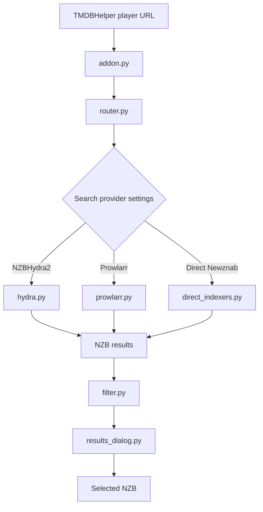
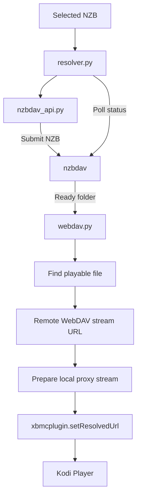
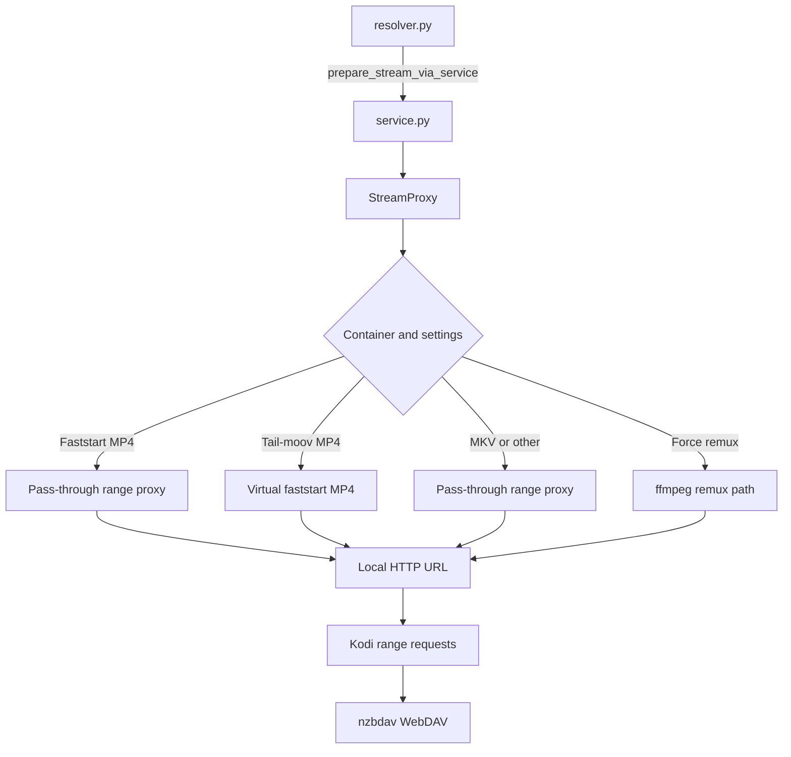

# Architecture

This document gives contributors a high-level map of the addon paths that turn a
TMDBHelper play request into a Kodi stream. User-facing setup and usage stay in
the [README](../README.md); detailed proxy internals stay in
[proxy-architecture.md](proxy-architecture.md).

## Search Flow

The router turns the Kodi plugin invocation into a movie or episode search.
Enabled providers return raw results, `filter.py` parses and ranks them, and the
result picker returns the NZB the user wants to play.

## Resolve Flow

The resolver submits the selected NZB, waits for nzbdav to expose a playable
file over WebDAV, asks the background service to prepare a local proxy URL, and
then resolves the Kodi handle. Failure paths still resolve the handle with a
failed item so Kodi does not hang waiting for playback.

## Stream Proxy Flow

The background service owns the long-lived proxy. The proxy hides WebDAV quirks
from Kodi, preserves range seeking where possible, can rewrite MP4 layout for
playback, and can use ffmpeg when the configured remux path is needed.

## Key Modules

| Module | Role |
|---|---|
| `router.py` | Dispatches Kodi plugin routes into search and playback actions. |
| `hydra.py`, `prowlarr.py`, `direct_indexers.py` | Search configured NZB providers. |
| `filter.py` | Parses release metadata, filters results, and sorts candidates. |
| `results_dialog.py` | Displays filtered results and returns the selected NZB. |
| `resolver.py` | Submits the NZB, polls nzbdav, prepares playback, and resolves Kodi handles. |
| `webdav.py` | Discovers playable files and builds WebDAV stream URLs. |
| `service.py` | Runs the background proxy service and playback monitoring. |
| `stream_proxy.py` | Serves local playback URLs and handles pass-through, MP4 rewrite, remux, and recovery paths. |
